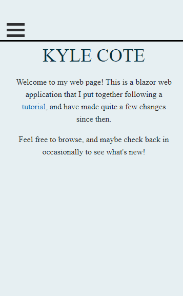
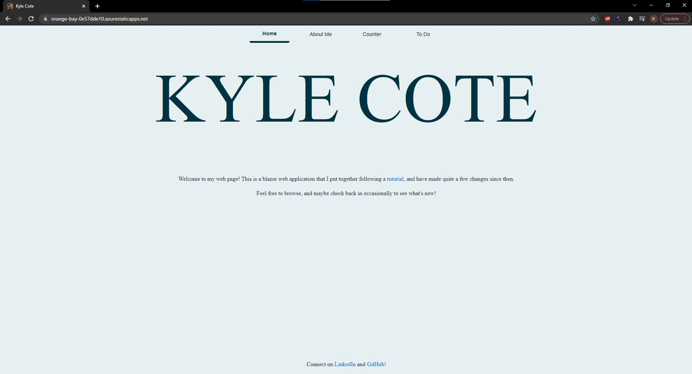

# Blazor Web Application

This is a blazor web application based on [this tutorial](https://devblogs.microsoft.com/aspnet/azure-static-web-apps-with-blazor/). I built upon the base provided as an assignment for an FGCU programming class during my junior year, and modified parts of it for fun and experience. 

## Demonstration
Feel free to [check it out!](https://orange-bay-0e57dde10.azurestaticapps.net/)

  

## Built With
* Visual Studio 2019
*   With ASP.NET and web development tools installed
* Microsoft Azure

## Getting Started
* Clone repository to your machine
*   Ensure ASP.NET or equivalent is installed
* From the Client directory in CMD, run "dotnet watch run"

## Author

Kyle Cote

## Acknowledgments

* https://devblogs.microsoft.com/aspnet/azure-static-web-apps-with-blazor/
* Professor Vanselow

## History
From the base template linked at top of readme, I have embedded the live music stream, added the grade calculators, added the todo list, and added the about me page.
