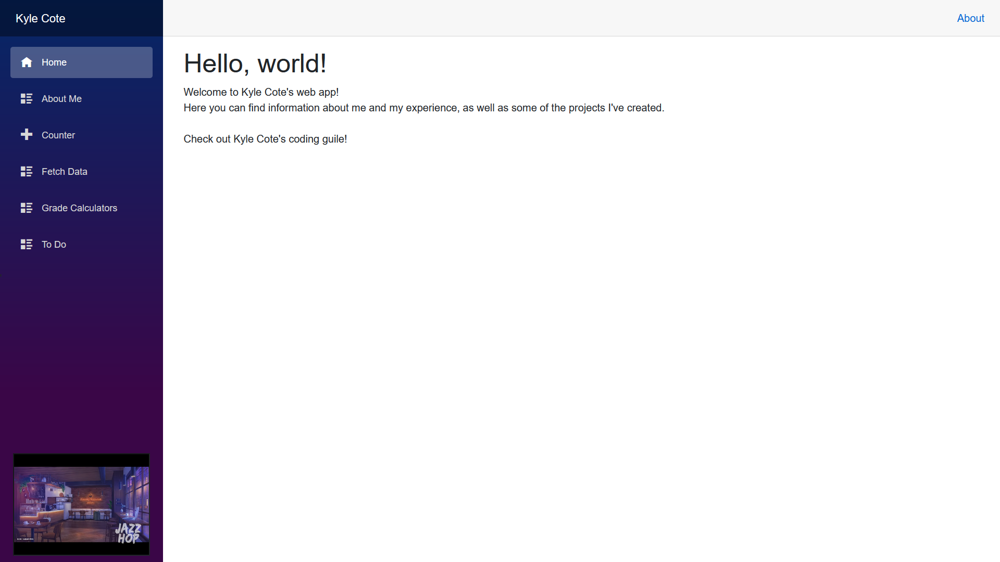

# Blazor Web Application

This is a blazor web application based on [this tutorial](https://devblogs.microsoft.com/aspnet/azure-static-web-apps-with-blazor/). I built upon the base provided as an assignment for an FGCU programming class during my junior year, and modified parts of it for fun and experience. 

## Demonstration
Feel free to [check it out!](https://orange-bay-0e57dde10.azurestaticapps.net/)

## Author

Kyle Cote

## Acknowledgments

* https://devblogs.microsoft.com/aspnet/azure-static-web-apps-with-blazor/
* Professor Vanselow
